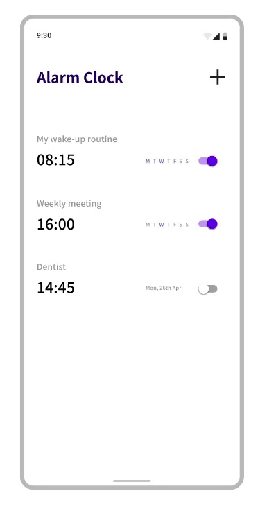

# Challenging Alarm Clock App

This repo is about creating an alarm clock app that is challenging the user by making him/her to solve a problem before the alarm sound stops.

The app is not completed yet, there are still many things to be improved and implemented.

## Getting Started


To run and debug the app, 
run ```main.dart``` on a device like on a physically available smartphone, 
on a virtually created smartphone
or on the Chrome browser for example.
To refresh the project, it's possible to use the hot reload function. 

<!--
To see the wireframe of the app, click on "Open Flutter DevTools" in the debug window below 
while running the debug mode.
-->


## About the Prototype


Create and Manage Alarms         |  Alarm Challenge
:-------------------------:|:-------------------------:
  |  


## About the Flutter App

Preview         |  Information
:-------------------------:|:-------------------------:
  |  This and the following assets are showing a preview of a specific development status. The app is still in progress.

Alarm Overview          |  Adding Alarm
:-------------------------:|:-------------------------:
  |  

Ringing Alarm         |  Notification
:-------------------------:|:-------------------------:
  |  

Challenge Example 1         |  Challenge Example 2
:-------------------------:|:-------------------------:
  |  


## About the Clickdummy & the App
In the project folder, there are some assets such as screenshots and videos of the clickdummy and the app.
To record the prototype in Figma and Android Studio, I used the Windows Recorder. For editing such as cropping the video to right format,
I used [this website](https://online-video-cutter.com/de/).

## To Do Long-Term
- Handle time zone issue
- For changing the page, there are some nice animations like described in [here](https://github.com/flutter/packages/tree/master/packages/animations).
- Edit alarm fuction (e.g. via "GestureDetector" class); I tried this in another branch, 
  but it's a lot of work, so I didn't implement it in the main branch
- Snooze function
- Functions to change alarm sound, vibration pattern, volume, snooze etc. 
  (and integrate in all into the CustomAlarm class)
- Sort alarms via date (I currently sort via dataframe index) 
  via a regularly called function _sortDatafrane
- UI/UX improvements 
    - Improve graphical design (whitespace, fonts, ...)
    - The app is not really responsive so far; 
      heights etc. are partially absolute; 
      use more "Flexible"/"Expanded" classes etc. to avoid text overflows 
      and to make the app work on every device
    - by making a friendly dialogue for requestPermissionToSendNotifications
    - chose time via "now" field etc.
- Maybe use bloclibrary.dev for states
- Different challenge modes (quiz, mathematical problem etc.)
  - Quiz can be done via some API like [this](https://the-trivia-api.com/)
  - Mathematical questions are probably easier without API
- Challenge should be adapted to the user's cognitive characteristics (e.g. easier challenge for children etc.)
- Improve alarm notification
  - It works when app is active, when app is in background, when the screen is off
  - It does not work yet when the app is terminated
  - No wake up notification yet
- Autoformat (add comma after every bracket etc.)
- Replace TimeOfDay by DateTime
- Current time presentation can be done better, e.g. like this: https://pub.dev/packages/slide_digital_clock

## General Remarks
- Don't use ```print``` in production code, it's better to use ``` debugPrint```  or ``` log``` is even more powerful.